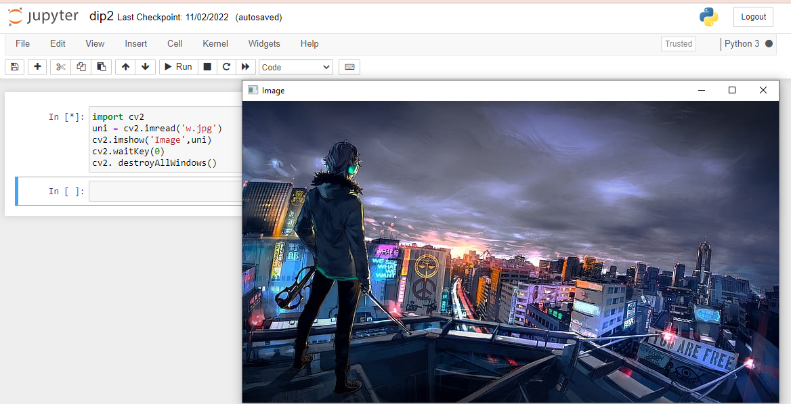
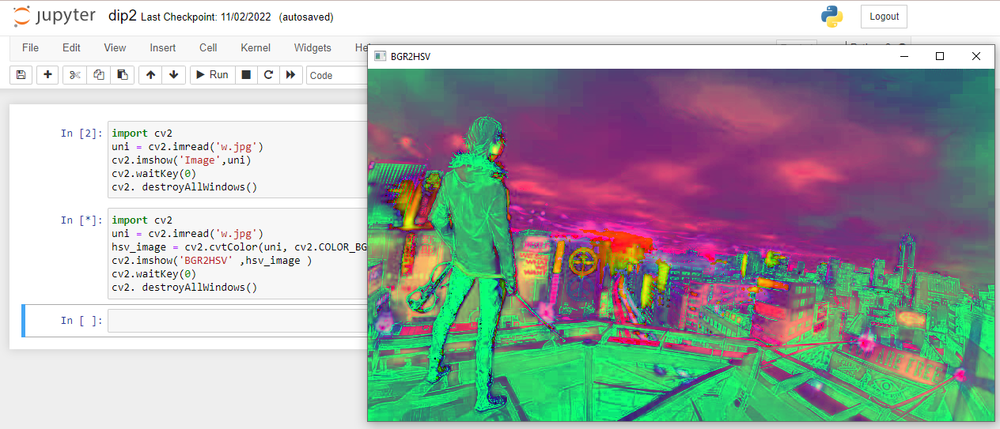
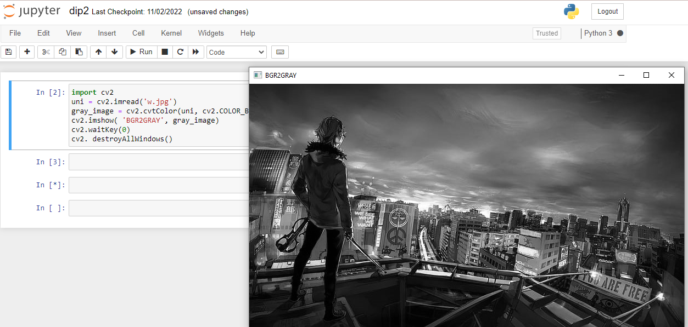
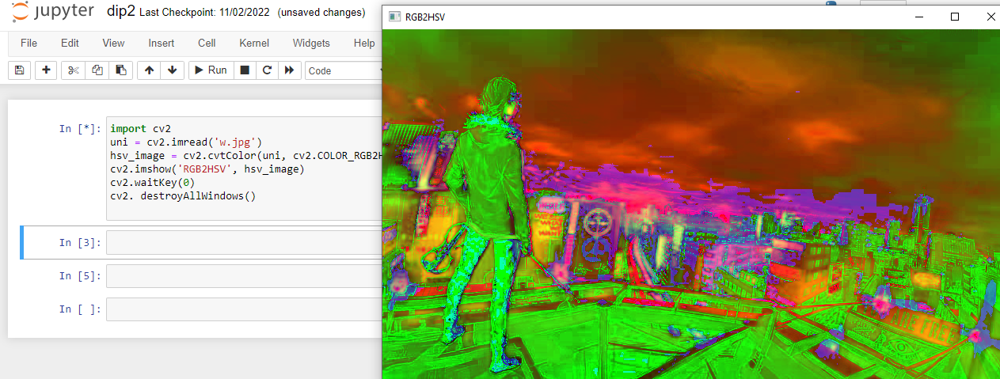
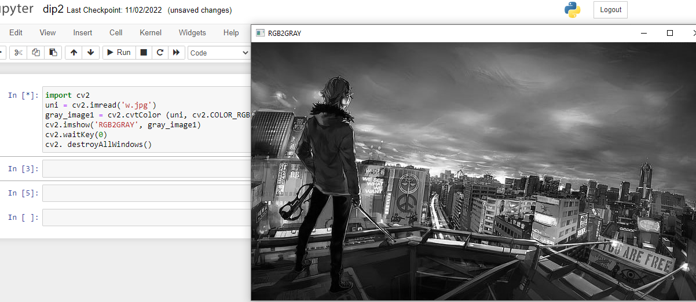
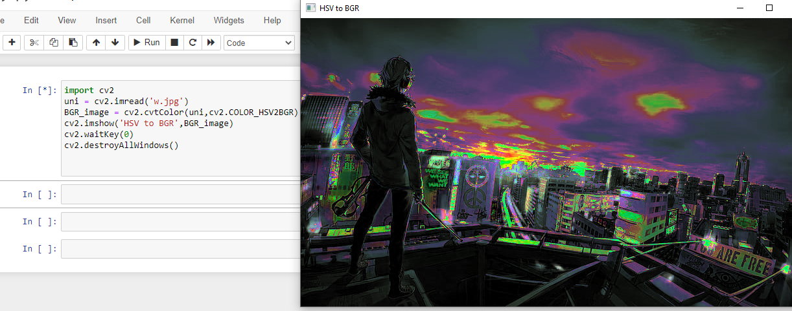
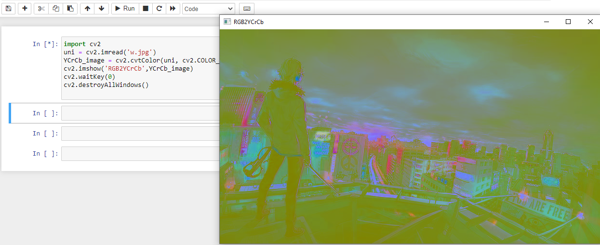
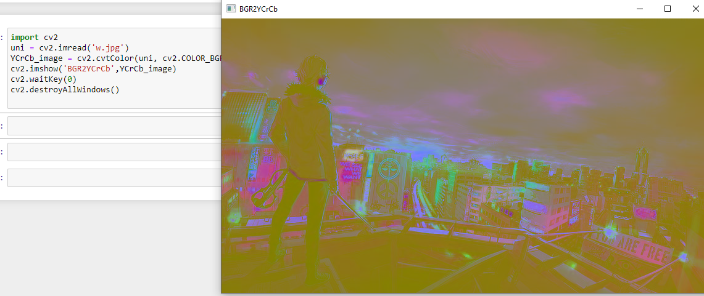
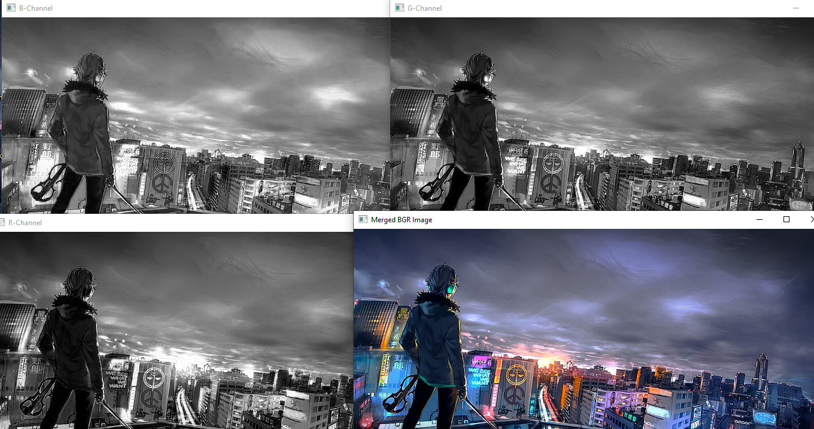
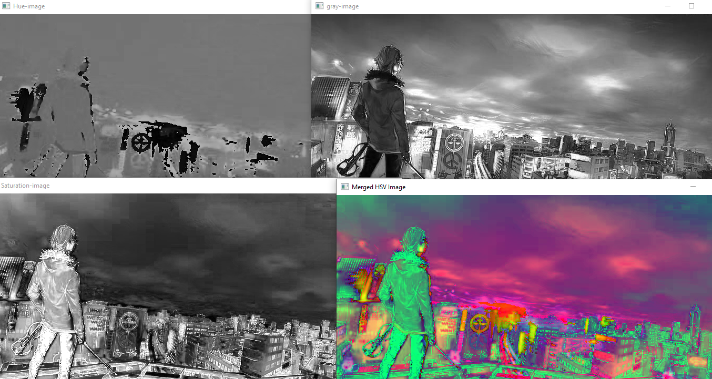

# Color Conversion
## AIM
To perform the color conversion between RGB, BGR, HSV, and YCbCr color models.

## Software Required:
Anaconda - Python 3.7
## Algorithm:
### Step1:

Import cv2 and save and image as filename.jpg

### Step2:

Use imread(filename, flags) to read the file


### Step3:

Use cv2.cvtColor(src, code, dst, dstCn) to convert an image from one color space to another.


### Step4:

Split and merge the image using cv2.split and cv2.merge commands.

### Step5:

End the program and close the output image windows.

## Program:
```python
# Developed By:V.NAVYA
# Register Number:212221230069
# i) Original Image

import cv2
uni = cv2.imread('w.jpg')
cv2.imshow('Original image',uni)
cv2.waitKey(0)
cv2. destroyAllWindows()

# ii) Convert BGR to HSV 

import cv2
uni = cv2.imread('w.jpg')
hsv_image = cv2.cvtColor(uni, cv2.COLOR_BGR2HSV)
cv2.imshow('BGR2HSV' ,hsv_image )
cv2.waitKey(0)
cv2. destroyAllWindows()

# iii)Convert BGR to GRAY


import cv2
uni = cv2.imread('w.jpg')
gray_image = cv2.cvtColor(uni, cv2.COLOR_BGR2GRAY)
cv2.imshow( 'BGR2GRAY', gray_image)
cv2.waitKey(0)
cv2. destroyAllWindows()


# iv) Convert RGB to HSV


import cv2
uni = cv2.imread('w.jpg')
hsv_image = cv2.cvtColor(uni, cv2.COLOR_RGB2HSV)
cv2.imshow('RGB2HSV', hsv_image)
cv2.waitKey(0)
cv2. destroyAllWindows()

# v)  Convert RGB to GRAY

import cv2
uni = cv2.imread('w.jpg')
gray_image1 = cv2.cvtColor (uni, cv2.COLOR_RGB2GRAY)
cv2.imshow('RGB2GRAY', gray_image1)
cv2.waitKey(0)
cv2. destroyAllWindows()

# vi) Convert HSV to RGB

import cv2
uni = cv2.imread('do.jpeg')
RGB_image = cv2.cvtColor(uni,cv2.COLOR_HSV2RGB)
cv2.imshow('HSV to RGB',RGB_image )
cv2.waitKey(0)
cv2.destroyAllWindows()

# vii)  Convert HSV to BGR

import cv2
uni = cv2.imread('w.jpg')
BGR_image = cv2.cvtColor(uni,cv2.COLOR_HSV2BGR)
cv2.imshow('HSV to BGR',BGR_image)
cv2.waitKey(0)
cv2.destroyAllWindows()

# viii)  Convert RGB to YCrCb


import cv2
uni = cv2.imread('w.jpg')
YCrCb_image = cv2.cvtColor(uni, cv2.COLOR_RGB2YCrCb)
cv2.imshow('RGB2YCrCb',YCrCb_image)
cv2.waitKey(0)
cv2.destroyAllWindows()

# ix) Convert BGR to YCrCb

import cv2
uni = cv2.imread('w.jpg')
YCrCb_image = cv2.cvtColor(uni, cv2.COLOR_BGR2YCrCb)
cv2.imshow('BGR2YCrCb',YCrCb_image)
cv2.waitKey(0)
cv2.destroyAllWindows()


# x) Merge RGB Image

import cv2
uni = cv2.imread('w.jpg')
blue=uni[:,:,0]
green=uni[:,:,1]
red=uni[:,:,2]
cv2.imshow('B-Channel',blue)
cv2.imshow('G-Channel',green)
cv2.imshow('R-Channel',red)

merged_BGR=cv2.merge((blue,green,red))
cv2.imshow('Merged BGR Image',merged_BGR)
cv2.waitKey(0)
cv2.destoryAllWindows()

# xi) Split HSV Image


import cv2
uni = cv2.imread('w.jpg')
hsv=cv2.cvtColor(uni,cv2.COLOR_BGR2HSV)
h,s,v=cv2.split(hsv)
cv2.imshow("Hue-image",h)
cv2.imshow("Saturation-image",s)
cv2.imshow("gray-image",v)

# xii) Merge HSV Image


Merged_HSV=cv2.merge((h,s,v))
cv2.imshow('Merged HSV Image',Merged_HSV)
cv2.waitKey(0)
cv2.destoryAllWindows()


```
## Output:
# i) Original Image



# ii) Convert BGR to HSV 




# iii)Convert BGR to GRAY




# iv) Convert RGB to HSV



# v)  Convert RGB to GRAY



# vi) Convert HSV to RGB


# vii)  Convert HSV to BGR




# viii)  Convert RGB to YCrCb




# ix) Convert BGR to YCrCb




# x) Merge RGB Image



# xi) Split HSV Image

# xii) Merge HSV Image




## Result:
Thus the color conversion was performed between RGB, HSV and YCbCr color models.
